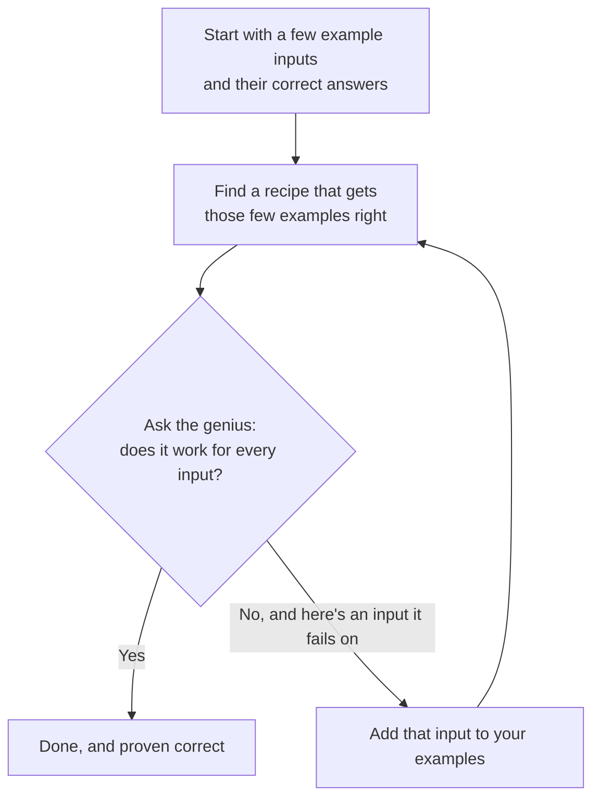

# Superopt, explained from scratch

This explains what the project does and why it's interesting. It assumes you know nothing about programming, compilers, or math. No background needed. Just read top to bottom.

## A program is a recipe

At its smallest, a computer program is a list of steps. A recipe. You give it some numbers, it follows the steps, and an answer comes out. A tiny one might be three or four steps long.

Here's a fact that catches people off guard: there's usually more than one recipe for the same dish. Say you want to double a number. You could add the number to itself. You could multiply it by two. There's even a low-level shuffling trick computers use that lands on the same result. Three recipes, identical answer every time. But some are shorter or cheaper than others.

This project takes one of those little recipes and hunts for the shortest recipe that does the exact same job. Then it does something unusual. It proves nothing shorter exists. Not "here's a faster one I found," but "this is the shortest one there can ever be, and here's why."

## Why "prove" is the interesting word

The thing that normally shrinks your code is a compiler. Picture it as a tidy-up editor with a big bag of tricks. It rewrites your recipe into a faster one using rules of thumb, and it's good at it. But it never claims the result is the best possible, because it has no way to know. It just stops when it runs out of tricks.

Superopt aims higher. It wants the shortest answer, proven. And the hard part hides in one small phrase: "the exact same job." What does it mean for two recipes to be the same?

It means they agree on every possible input. Not most of them. Every single one. That sounds simple. It's the whole problem.

## You can't just test it

Your first instinct is fair: run both recipes on a big pile of numbers and see if the answers line up. The trouble is that a pile isn't enough. To be sure, you'd have to try every number.

For one ordinary number on a computer, that's about four billion possibilities. Use two numbers and it balloons to billions times billions. Go to bigger numbers and checking them all would outlast the sun, even on a fast machine. So testing your way to certainty is a dead end. You could test for a year and still miss the one strange input where the two recipes quietly disagree.

We need a way to be sure without walking through every case.

## The trick at the center of everything

Here's the move the whole project rests on. There's a kind of tool called a solver, and this project uses a well-known one named Z3. The easiest way to picture it is a tireless logic genius. It doesn't try examples. It reasons.

You already do this. You know an even number plus an even number is always even. You didn't check every number to be sure. You reasoned it out, and now you just know. The solver does that same airtight reasoning, but about the logic buried inside programs.

Now the clever bit. Instead of asking the genius the impossible question, "are these two recipes the same across all four billion inputs?", you turn it into a dare:

> I bet you can't find even one input where these two recipes disagree.

Two things can come back.

The genius reasons it through and says it's impossible, they can never disagree. That's your proof. The recipes are the same, and you got there without touching a single one of those four billion cases.

Or the genius finds a disagreement and hands you the exact input where it happens. That's called a counterexample, and it's gold when you're hunting a bug, because it points straight at the mistake.

Asking it backwards like this, daring it to break the claim instead of asking it to bless the claim, is the foundation under everything else.

## Finding the shortest recipe, the honest slow way

Fine, so we can check whether two recipes match. How do we find the shortest one?

The simplest method is patient and a little dumb. List every recipe that's one step long and check each against your target. Nothing works? List every two-step recipe and check those. Then three steps. The first length where something matches has to be the shortest, because you already ruled out everything below it.

It's slow. There are mountains of recipes to sift through. But it's obviously right, and that's exactly why you build it first. It becomes a yardstick you trust, something to check the clever method against, so you'll know if the clever method ever lies to you.

## Finding it the smart way

The fast method is a guess-and-check loop, and it plays a lot like Wordle, where every wrong guess teaches you something.

Walk through it. You start with a couple of example inputs and the answers they're supposed to give. You find any recipe that gets those few right, which is easy, because there's barely anything to satisfy yet. Then you ask the genius the big question: does this recipe work for everything? If yes, you're done, and it's proven. If no, it hands you one input where the recipe fails. You add that troublemaker to your pile of examples and guess again.

Why this is fast instead of slow: each failure teaches you a lot. One failing input doesn't just kill your single wrong guess. It rules out the whole family of guesses that would trip on that same input. So even though there's an absurd number of possible inputs, you usually corner the right answer in a handful of rounds. Same as Wordle. A few sharp guesses, each with honest feedback, and suddenly there's only one word left.

## The part that's genuinely cool

Some of the slickest little programs depend on an exact, almost random-looking "magic number" baked inside them. A precise value that makes the trick click. If you were guessing whole recipes, you'd basically never land on the right magic number. It's one specific value out of billions.

But the genius reasons instead of guessing. So you can leave the number as a blank, a fill-in-the-blank, and ask it to work out the value that makes the recipe correct. It's solving for x, the way you did in school. You don't guess x. You figure out what it has to be. The solver discovers the magic number for you. The slow brute-force method could never pull this off, because it can only try numbers it already thought to write down. This is the one spot where the tool feels almost creative.

## What it leaves out, on purpose

Superopt sticks to small, simple recipes by design. No loops (steps that repeat), no reaching into the computer's memory, no decimals. Just short, straight-line math on whole numbers.

That's not laziness. Each of those features makes "are they truly the same for every input?" much harder to answer with certainty, and in some cases impossible to answer at all. Staying in the simple zone is what lets the genius give a clean, provable yes or no. You get that solid first. Each of the harder cases is a research project on its own.

## The whole thing in a paragraph

A program is a recipe, and many different recipes give the same answer. This tool finds the shortest one and proves it's the shortest. It can't prove that by testing every input, because there are far too many, so it hands the recipes to a logic-reasoning genius and dares it to find a disagreement. "Can't be done" is the proof. To find the shortest recipe, it either checks recipes from shortest on up, or plays a fast guessing game where every wrong guess narrows things down. And as a bonus, it can solve for the tricky magic numbers instead of guessing them.

## Want the real thing?

This skips all the math on purpose. The actual research behind it (the original superoptimizer, the solver, the guessing-game technique) is collected in [references.md](references.md).
