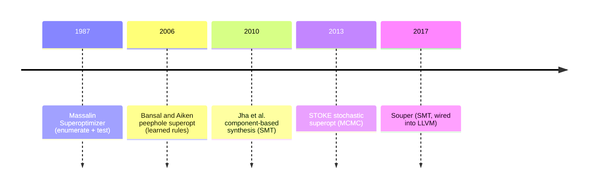

# Superoptimization

The idea: instead of improving a program with rewrite rules, search for the best
possible program that computes a given function, and prove it's optimal.

## Where it came from

The term is Alexia Massalin's, from her 1987 paper *Superoptimizer: A Look at
the Smallest Program*.[^massalin] Her program enumerated short instruction
sequences for a target function, ran them on test inputs to throw out the wrong
ones, and turned up startlingly short sequences no human would have written.

The "super" sets it apart from the peephole optimizer a compiler runs. A
peephole optimizer applies a fixed set of local rewrite rules (`x*2` becomes
`x<<1`) and stops when nothing else fires. It only finds the improvements
someone already wrote down as a rule. A superoptimizer searches the space of all
short programs instead, so it can turn up sequences nobody wrote a rule for. If
the search is exhaustive, it can also prove no shorter sequence exists.

## Two axes that define a superoptimizer

| Axis | Options | This project |
|------|---------|--------------|
| Search strategy | exhaustive enumeration, stochastic (MCMC), SMT synthesis | enumeration (Phase 3), then SMT/CEGIS (Phase 4) |
| Correctness check | test-based (sample inputs), formal (prove for all inputs) | formal, via SMT — see [[02-equivalence-via-unsat]] |

Massalin's original checked correctness by testing, which is fast but can wave
through a wrong program that happens to agree on the inputs you sampled. The
modern move, and the one this project takes, is to swap testing for a formal
equivalence proof. Then "optimal" means correct for every input, not just the
ones you tried.

## Where this project sits

Bansal and Aiken (2006) harvested optimal rewrite rules offline and applied them
like a giant peephole table.[^bansal] STOKE (2013) treats optimization as a
random walk: mutate the program, accept or reject by a cost function, repeat. It
reaches longer sequences than enumeration can, but it gives up the
exhaustive-optimality guarantee.[^stoke] Souper (2017) is the closest production
relative of this project — an SMT-based synthesizing superoptimizer that plugs
into LLVM and finds optimizations the compiler missed.[^souper] It's the
reference codebase named in the plan.

This project stakes out the provably-optimal, short, loop-free integer and
bitwise corner. That's small enough that exhaustive enumeration (Phase 3) is a
real baseline, and SMT synthesis (Phase 4) can prove optimality rather than just
improve on what it's given.

## Why scope it this way

Loops, memory, and floating point each blow up the equivalence problem. Loops
need invariants. Memory needs the theory of arrays. Floats need bit-exact IEEE
reasoning. Sticking to straight-line integer and bitwise routines keeps the
equivalence query decidable and fast (see [[01-smt-and-bitvectors]]), and that's
what makes "provably optimal" tractable for one person.

## Next

Next: [[01-smt-and-bitvectors]], the solver technology that makes formal
equivalence checking possible.

[^massalin]: Massalin, A. (1987). *Superoptimizer: A Look at the Smallest Program.* ASPLOS II. https://dl.acm.org/doi/10.1145/36206.36194
[^bansal]: Bansal, S., & Aiken, A. (2006). *Automatic Generation of Peephole Superoptimizers.* ASPLOS. https://dl.acm.org/doi/10.1145/1168857.1168906
[^stoke]: Schkufza, E., Sharma, R., & Aiken, A. (2013). *Stochastic Superoptimization.* ASPLOS. https://dl.acm.org/doi/10.1145/2451116.2451150
[^souper]: Sasnauskas, R., et al. (2017). *Souper: A Synthesizing Superoptimizer.* arXiv:1711.04422. https://arxiv.org/abs/1711.04422
