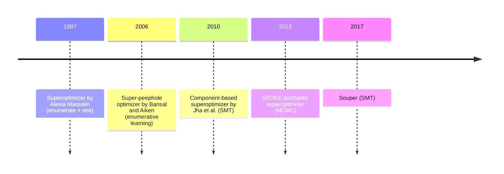

# Superoptimization

Instead of making the given program better using rewrite rules, one could try searching for the best program that implements the desired function and showing its optimality.

## Background

The term is first introduced in the work by Alexia Massalin *Superoptimizer: A Look at the Smallest Program* from 1987.[^massalin] Her technique involved enumerating the shortest programs computing the target function, checking them against the sample inputs and finding programs too efficient and elegant for a human to write.

While compared to a peephole optimizer, where the search is guided by a finite set of rewrite rules like multiplication by two to left shift (x*2 => x<<1) and stops once the rules are exhausted, a superoptimizer explores the space of programs exhaustively, which allows for discovering new combinations that were never covered before. When the space is fully explored, it even allows proving optimality.

## Definition

There are two dimensions along which superoptimizers can vary.

| Dimension       | Variants                  | This Project               |
|-----------------|---------------------------|----------------------------|
| Search strategy | Enumerative, stochastic (Markov chain Monte Carlo (MCMC)), synthesis using Satisfiability Modulo Theory (SMT) | Enumerative (in Phase 3), then SMT (CEGIS) (Phase 4) |
| Checking        | Testing                   | Formal, using SMT (see [[02-equivalence-via-unsat]]) |

With a formal equivalence checking, one defines “optimality” to mean correctness over all possible inputs rather than just tested inputs. That is another difference between the traditional approach (used by Alexia Massalin) and today's approach (this project included).

## Context for this project

A recent example of a peephole-based superoptimizer is the work by Bansal and Aiken (2006). They developed an algorithm to learn peephole superoptimizer rules automatically and use them to optimize the given program. STOKE by Schkufza et al. (2013) takes a stochastic approach: it considers each program modification as mutation and accepts/rejects it based on how much improvement it brings. Although capable of producing longer sequences of instructions than the previous methods, it gives up on completeness. Souper (2017) is perhaps the closest predecessor to the current project; it is an SMT-based synthesizing superoptimizer that integrates with LLVM and reveals hidden optimizations not found by the compiler.[^souper]. It will serve as the reference implementation described in the proposal.

This project focuses on generating optimal, small and loop-free integer and bitwise optimizations. With this narrowed-down domain, exhaustive enumeration is still applicable (Phase 3) and SMT-based synthesis (Phase 4) allows proving optimality.

## Why?

It is significantly easier to prove equivalence between straight-line integer or bitwise programs than the ones containing loops, memory accesses or involving floating point numbers. Loops need invariants, memory access needs array analysis and floats are notoriously difficult to reason about. This project limits itself to deciding equivalence in straight-line integer and bitwise programs (see [[01-smt-and-bitvectors]])

## Next

Next, [[01-smt-and-bitvectors]] on the SMT solvers and bit vectors.

References:
[^massalin]: Massalin, A. (1987). *Superoptimizer: A Look at the Smallest Program.* ASPLOS II. https://dl.acm.org/doi/10.1145/36206.36194
[^bansal]: Bansal, S., & Aiken, A. (2006). *Automatic Generation of Peephole Superoptimizers.* ASPLOS. https://dl.acm.org/doi/10.1145/1168857.1168906
[^stoke]: Schkufza, E., Sharma, R., & Aiken, A. (2013). *Stochastic Superoptimization.* ASPLOS. https://dl.acm.org/doi/10.1145/2451116.2451150
[^souper]: Sasnauskas, R., et al. (2017). *Souper: A Synthesizing Superoptimizer.* arXiv:1711.04422. https://arxiv.org/abs/1711.04422
