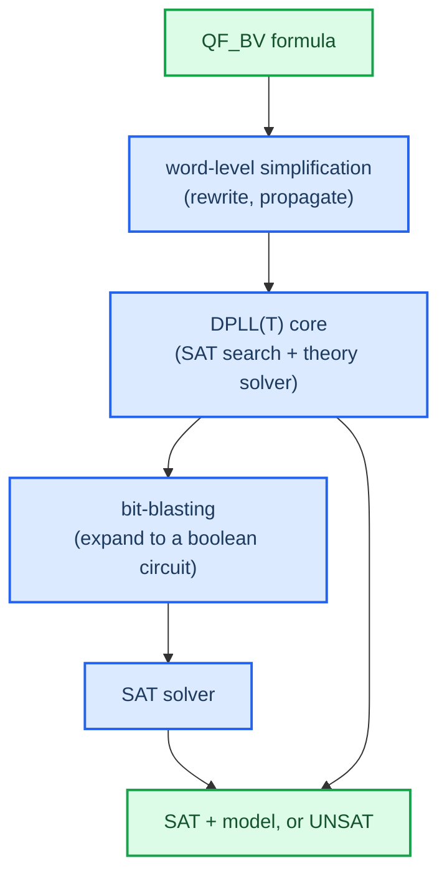

# SMT. And bit-vector theory

The heart of the toolchain is an SMT solver. Before using it, I have to grasp what kind of problems it can solve and what assumptions the bit-vector theory makes about machine integers.

## From SAT to SMT

A SAT solver basically tries to determine if the provided boolean formula has a satisfying assignment, in other words, a concrete set of values for its variables. While SAT is a decidable problem, it is NP-complete, but modern solvers are quite fast anyway.

SMT, or satisfiability modulo theories, is SAT extended to variables of non-boolean types, integers, reals, arrays, uninterpreted functions, and fixed-width bit-vectors. In other words, SMT tries to find out if a formula with certain variables is satisfiable according to a specified theory. This particular solver used in this project is Z3 developed by Microsoft Research.

## The bit-vector theory (QF_BV)

This section explains why QF_BV is exactly the theory for representing machine integers.

| Machine reality | QF_BV models it as |
|------------------|---------------------|
| 8/16/32/64-bit registers | bit-vectors of fixed width `w` |
| wraparound on overflow | arithmetic modulo `2^w` |
| signed with two's complement | same bit-vector, different semantics |
| bitwise & shifts | natural operations |

What matters in the end is that an 8/16/32/64-bit bit-vector has exactly 2**width possible values and overflow wraps exactly as on real hardware, so nothing is approximated here. Equivalence proved on a bit-vector theory actually proves equivalence on the real program with finite machine integers, not an infinitely precise mathematical one.

### Signedness vs unsignedness exists in the operation, not the value

As far as QF_BV is concerned, a bit-vector is a vector of bits without any other meanings attached. There is neither a signed bit-vector nor an unsigned bit-vector; there are signed and unsigned operations over the same bit-vector. For example, an 8-bit bit-vector value `0b1111_1111` is either `255` when interpreted as unsigned or `-1` as a two's-complement signed integer. Consequently, QF_BV distinguishes between unsigned `<` and signed `<` operations, and logical shift right from arithmetic shift right. Using the wrong operation silently is a bug.

## How the solver decides QF_BV formulas

There are finitely many possible values for every variable. Therefore, a QF_BV formula is fully defined as soon as all variables' widths become known. This allows rewriting QF_BV formulas into plain boolean circuits and solving them using SAT solvers. Decidability is basically the property that makes QF_BV useful for this project. QF_BV solver always terminates with a decision: SAT or UNSAT.

## What to internalize before writing `encode.py`

`BitVecVal(c, w)` is a literal constant of width `w`. One should use it instead of a literal integer since Python promotes integer literals implicitly without complaining, thus hiding a possible mistake. The table of opcodes and corresponding Z3 operators shows which operator corresponds to each opcode, and which combination of signedness and shift to each interpreter instruction.

Next: [[02-equivalence-via-unsat]], encoding of equivalence queries.

[^smtlib]: Barrett, C., Fontaine, P., & Tinelli, C. *The SMT-LIB Standard*, theory of FixedSizeBitVectors. https://smtlib.cs.uiowa.edu/theories-FixedSizeBitVectors.shtml
[^z3]: de Moura, L., & Bjørner, N. (2008). *Z3: An Efficient SMT Solver.* TACAS. https://link.springer.com/chapter/10.1007/978-3-540-78800-3_24
