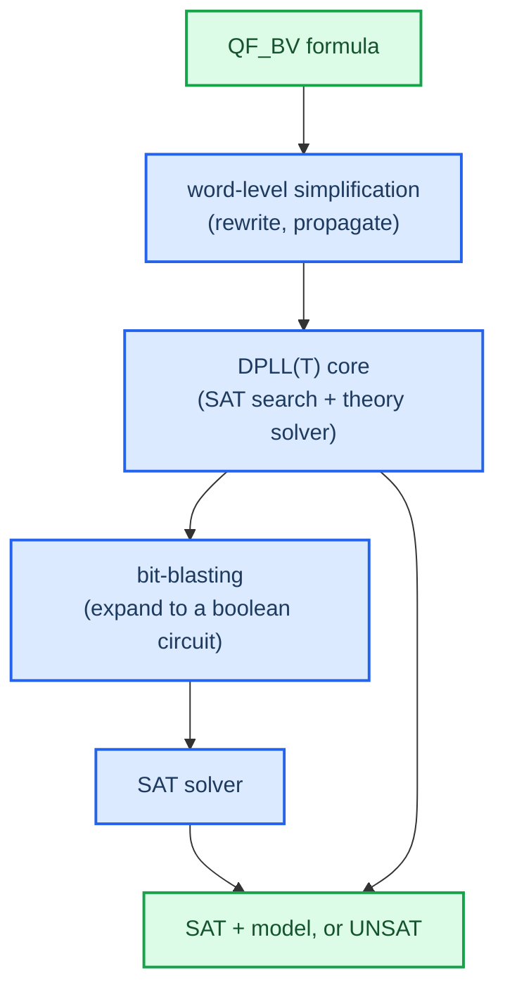

# SMT and bit-vector theory

SMT is the engine. To use it well I need to know what it decides and how the
bit-vector theory models machine integers exactly.

## From SAT to SMT

A SAT solver answers one question: does this boolean formula have an assignment
of true and false to its variables that makes it true? SAT is decidable but
NP-complete, and modern solvers are still fast in practice.

SMT — satisfiability modulo theories — lets the variables range over more than
booleans: integers, reals, arrays, uninterpreted functions, and fixed-width
bit-vectors.[^smtlib] So the question becomes "is this formula satisfiable given
the rules of theory T" rather than just "is this boolean formula satisfiable."
Z3, from Microsoft Research, is the solver this project uses.[^z3]

## The bit-vector theory (QF_BV)

The theory I care about is QF_BV: quantifier-free, fixed-size bit-vectors. It's
the right model for machine integers because it captures how they actually
behave.

| Machine reality | QF_BV models it as |
|-----------------|--------------------|
| 8/16/32/64-bit registers | bit-vectors of fixed width `w` |
| wraparound on overflow | arithmetic modulo `2^w` |
| signed via two's complement | same bits, signed operations reinterpret them |
| bitwise ops and shifts | native operators |

The property that matters: a 32-bit `BitVec` has exactly `2^32` values, and
`a + b` wraps the same way hardware does. Nothing is approximated. That's why an
equivalence proof in QF_BV is a proof about the real program, not about some
idealized infinite integer.

### Signed versus unsigned lives in the operation, not the value

A bit-vector is just bits. There's no such thing as a signed bit-vector, only
signed and unsigned operations over the same bits. The 8-bit value `0b1111_1111`
is `255` read as unsigned and `-1` read as two's complement. So the theory
separates unsigned `<` from signed `<`, and logical right shift (`LShR`,
zero-fill) from arithmetic right shift (sign-fill). Getting that wrong is the
classic silent encoding bug — see [[encodings/shifts]].

## How the solver decides QF_BV

Every variable has a finite width, so a QF_BV formula can in principle be
bit-blasted: rewritten into a plain boolean circuit and handed to a SAT solver.
That's what makes QF_BV decidable. The solver always finishes with SAT or UNSAT,
never "don't know." Real solvers do plenty of word-level reasoning first to
dodge blasting when they can, but the finiteness is what guarantees an answer.

Decidability is the property the whole project leans on. It means an equivalence
query (see [[02-equivalence-via-unsat]]) always comes back with a definite
answer.

## What to internalize before writing `encode.py`

`BitVecVal(c, w)` is a literal constant of width `w`. I should reach for it
instead of a raw Python int, which can promote width silently and hide a bug.
Each opcode maps to a specific Z3 operator, and the signedness and shift choices
have to match the interpreter exactly — that's what the encoder-versus-
interpreter cross-check verifies in Phase 2. Overflow is automatic and modular,
which is usually what I want, but `NEG` of the minimum signed value and
multiplication wraparound deserve a deliberate note alongside [[encodings/shifts]].

## Next

Next: [[02-equivalence-via-unsat]], turning "are these equal for all inputs"
into a single solver call.

[^smtlib]: Barrett, C., Fontaine, P., & Tinelli, C. *The SMT-LIB Standard*, theory of FixedSizeBitVectors. https://smtlib.cs.uiowa.edu/theories-FixedSizeBitVectors.shtml
[^z3]: de Moura, L., & Bjørner, N. (2008). *Z3: An Efficient SMT Solver.* TACAS. https://link.springer.com/chapter/10.1007/978-3-540-78800-3_24
