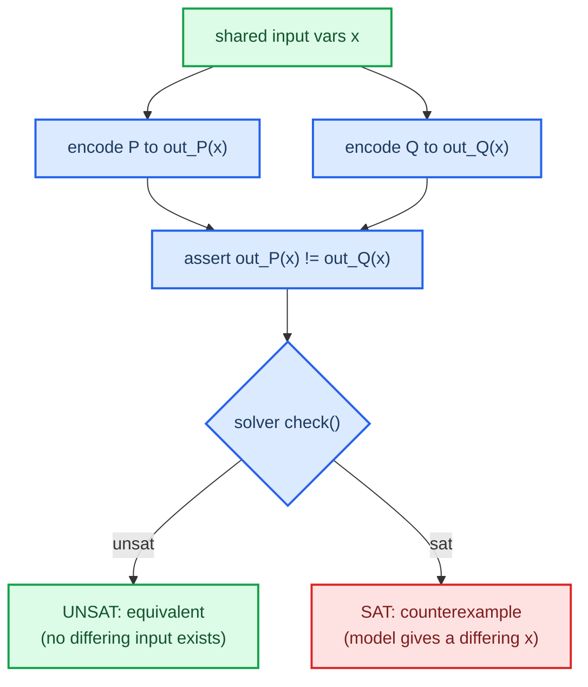

# Equivalence via UNSAT

This is the most important logical move in the project. I prove two programs
agree on every input by asking the solver to find one input where they disagree,
and watching it fail.

## The goal, and the obstacle

What I want is a statement about all inputs:

> For all inputs `x`, `P(x) = Q(x)`.   (∀x. P(x) = Q(x))

But SMT solvers decide satisfiability, not validity. They answer "is there an
assignment that makes this formula true," not "is this formula true under every
assignment." So I can't ask the ∀ question directly.

## Validity via unsatisfiability

The bridge is a standard duality. A statement is valid — true for every input —
exactly when its negation is unsatisfiable, true for no input. Apply that to the
equivalence claim. `∀x. P(x) = Q(x)` holds exactly when

> `∃x. P(x) ≠ Q(x)` is unsatisfiable.

So I encode the difference query, "is there an input where the outputs differ,"
and hand it over:

- UNSAT means no such input exists, so `P` and `Q` are equivalent. Done.
- SAT means the solver found a model, and that model is a concrete
  counterexample: a real input where the two disagree.

That's why UNSAT, not SAT, is the answer I'm hoping for when I prove
equivalence. Worth saying in my own words in the Phase 0 `DECISION_LOG.md`
entry, because it's the kind of thing that's obvious once it clicks and
confusing right before.

## The query itself

Both programs are encoded over the same input variables, so "same input" is true
by construction. The only thing I assert is that the outputs differ.

## Where the proof's trust actually lives

An UNSAT result is only as good as the encoding behind it. The solver proves a
fact about the formula I gave it. If that formula misrepresents the program —
wrong shift, wrong signedness, wrong overflow — I get a confident UNSAT about
the wrong thing, which is a "verified" optimal program that's actually broken.

The plan has two defenses against that. The encoder-versus-interpreter
cross-check in Phase 2 forces the SMT encoding and an independent Python
interpreter to agree on random programs and random inputs, which catches a
mis-encoded opcode before it can poison a proof. The independent fuzz harness in
Phase 6 re-checks every emitted "optimal" program against the reference spec on
millions of random inputs, using code that shares nothing with the encoder.

This is the gap decidability (see [[01-smt-and-bitvectors]]) does not close. The
solver is sound for the formula. Only the cross-checks make the formula faithful
to the program.

## Next

Next: [[03-synthesis-and-constants]], going from checking a given program to
finding one.
