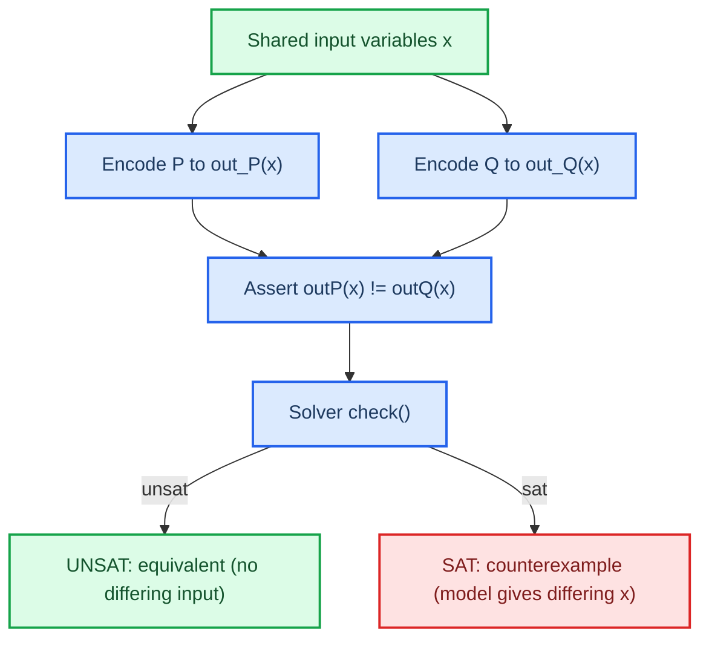

# Equivalence through UNSAT

This is the core logical move of the project. I prove two programs are equivalent over all inputs by asking the solver to find an input at which they differ, and failing.

## The problem, and the solution

What I want is:
For all inputs, P(x) = Q(x). (∀x. P(x) = Q(x))
But SMT solvers only decide "does there exist an input where this is true?", not "is this true for all inputs?".
So I can't ask that.

## Validity via unsatisfiability

The solution uses a well-known duality. A statement is true for all inputs iff its negation is true for no inputs.
In our case, ∀x. P(x) = Q(x) iff ∃x. P(x) != Q(x) is unsatisfiable.
So, I give the solver the question: Does there exist an input where the outputs differ?
UNSAT means no, which proves equivalence. SAT means, I found an input where the outputs differ - a counterexample.
Therefore, I want UNSAT for a proof of equivalence. This should probably be stated clearly in my Phase 0 entry, DECISION_LOG.md.

## The actual query

Both programs are encoded to run over the same input variables, so that part of the statement is satisfied by construction. The only assertion I need is that the outputs are different.

## Where does the proof actually rely on trust?

An UNSAT response relies completely on the correctness of the encoding. The solver proves the assertion for the given formula. If I encoded it wrongly (incorrect shift or signedness, for example) I'll get a perfectly confident UNSAT statement about a different thing to what I intended.
I have two defenses against this:

1. In Phase 2, the encoder is checked against an interpreter on random programs and random inputs. This should catch obvious coding errors before the encoding gets into a proof.
2. In Phase 6, a completely separate harness rechecks any generated optimal programs, million of times on random inputs, against the original spec.

This is the part of the problem that solvability doesn't actually solve. The solver is sound with respect to the encoding, but it takes the cross-checks to make the encoding itself sound.

## Next steps

[[03-synthesis-and-constants]]
