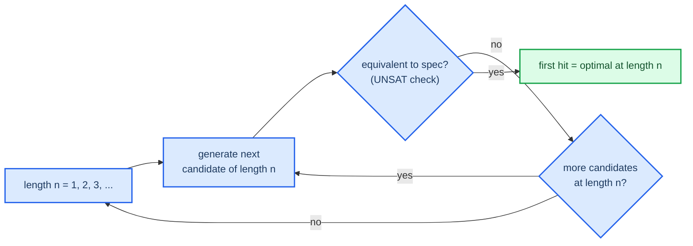

# Program synthesis and the constants problem

Equivalence checking verifies a program I already have. Synthesis is the harder
direction: find a program that meets a specification. This note frames the
synthesis problem and the specific reason brute-force enumeration falls apart —
constants — which is what motivates the SMT approach in [[04-cegis]].

## The synthesis problem

Given a specification (here, a reference function, either as a Python spec or an
SMT formula), find a program `P` from some space of allowed programs such that
`P` meets the spec for every input. For this project the space of allowed
programs is straight-line sequences over the chosen instruction set, up to some
length, with each instruction's operands wired to inputs or earlier results.

## Enumerate and verify, the Phase 3 MVP

The simplest method that works:

Searching by increasing length hands me optimality for free. The first length
where any candidate verifies is the minimum, because I exhausted every shorter
length first (see [[05-optimality]]).

## Why constants break it

Enumeration is fine while the candidate space stays small. Constants are what
break it.

A lot of the interesting routines need one specific constant: a mask, a magic
multiplier, a De Bruijn sequence. If the instruction set has a `const` operand,
enumeration has to try every possible value for it.

| Width | Constant values to enumerate |
|-------|------------------------------|
| 8-bit | 256 |
| 16-bit | 65,536 |
| 32-bit | 4,294,967,296 |
| 64-bit | about 1.8 × 10¹⁹ |

At 32 bits, one `const` slot multiplies the search by roughly four billion. Add
a second slot and enumeration is hopeless. This isn't a constant-factor
slowdown. It's the line between a search that finishes and one that never does.

## The insight: constants as free variables

An SMT solver doesn't enumerate the constant. It solves for it. I encode the
constant as a free bit-vector variable and let the solver find a value that
makes the program meet the spec. The `2^32` possibilities get explored
symbolically inside the solver, not one at a time.

This is the biggest reason the SMT and CEGIS approach in Phase 4 scales where
enumeration can't, and the project `CLAUDE.md` flags it as a real insight worth
writing up myself. The crisp version for the report: enumeration treats a
constant as `2^w` separate programs to test, while SMT treats it as one unknown
to solve.

## The catch that motivates CEGIS

Once constants and the wiring are unknowns the solver has to find, the synthesis
query reads naturally as "is there a program correct on all inputs?" That's an
`∃P. ∀x` statement, and the quantifier alternation in it is expensive for
solvers to attack head-on. CEGIS is the trick that breaks that `∃∀` into a loop
of cheap, quantifier-free queries. Continue to [[04-cegis]].
