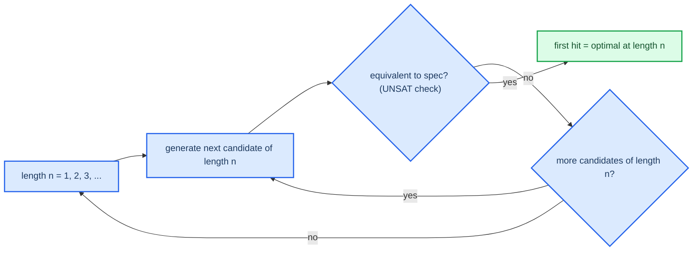

# Program synthesis and the constants problem

While equivalence checking confirms a program that I already possess, synthesis takes the problem in the other direction and finds a program that fulfills a given specification. This note briefly introduces the synthesis problem and specifically addresses the issue of constants which makes the bruteforce enumeration fall apart, the exact issue that motivates the use of SMT solvers in [[04-cegis]].

## The synthesis problem

The synthesis problem is to find a program $P$ from a given space of allowed programs, that satisfy a specification, in this case a reference function provided as either a Python function or a formula of SMT logic, for all possible inputs. For the purposes of this project, the space of allowed programs is defined as a sequence of instructions executed on the selected instruction set without control flow, of a given length, with each instruction taking inputs that are wired to either direct inputs to the program or to the results from preceding instructions.

## Enumerate and verify, the Phase 3 MVP

The simplest approach is to generate every candidate program and then verify its correctness.

Because this approach tries programs of increasing lengths, the first correct program discovered is guaranteed to be optimal in terms of length (see [[05-optimality]]).

## Why constants break it

While enumeration works fine with a limited candidate space, it fails when dealing with constants.

Many of the interesting routines utilize a single specific constant value, such as a bitmask, a multiplier, or even a value from a De Bruijn sequence. When constants are present in the candidate programs, the brute-force search has to enumerate over every possible value that the constant may take.

| Width | Possible values to enumerate for a single constant |
|-------|-------------------------------------------------|
| 8-bit | 256 |
| 16-bit | 65,536 |
| 32-bit | 4,294,967,296 |
| 64-bit | approximately 1.8e19 |

At 32-bits, one const operand exponentially increases the size of the search space by four billion times. Another const operand makes enumeration intractable. This is not merely a factor of speed, but rather the difference between completing a search and never completing it.

## The insight: constants as free variables

Instead of brute-forcing through possible constant values, the SMT solver can be used to solve for them. A constant within the program is modeled as a free bit-vector variable. The solver is then used to find values of this variable such that the resulting program satisfies the specification. Essentially, the $2^w$ possible values are explored symbolically within the solver, rather than explicitly tested.

This is the major reason why the SMT-based CEGIS approach used in Phase 4, is more scalable than enumeration and is considered to be a key insight of the project, which merits documenting in one's own words: enumeration treats a constant as $2^w$ separate candidate programs to verify, whereas the SMT approach considers the constant as a single unknown to be solved.

## The catch that motivates CEGIS

With the introduction of unknowns for both constants and the program's instruction wiring, the problem is now framed as: "does there exist a program $P$ such that for all inputs $x$, $P(x)$ equals the reference function?" This is a $\exists P. \forall x. P(x) = F(x)$ statement, the alternating quantifier structure of which is notoriously difficult for solvers to handle efficiently. CEGIS is the strategy to bypass this expensive "attack" on the quantifier structure by repeatedly transforming the problem into a cheaper, quantifier-free one. Proceed to [[04-cegis]].
