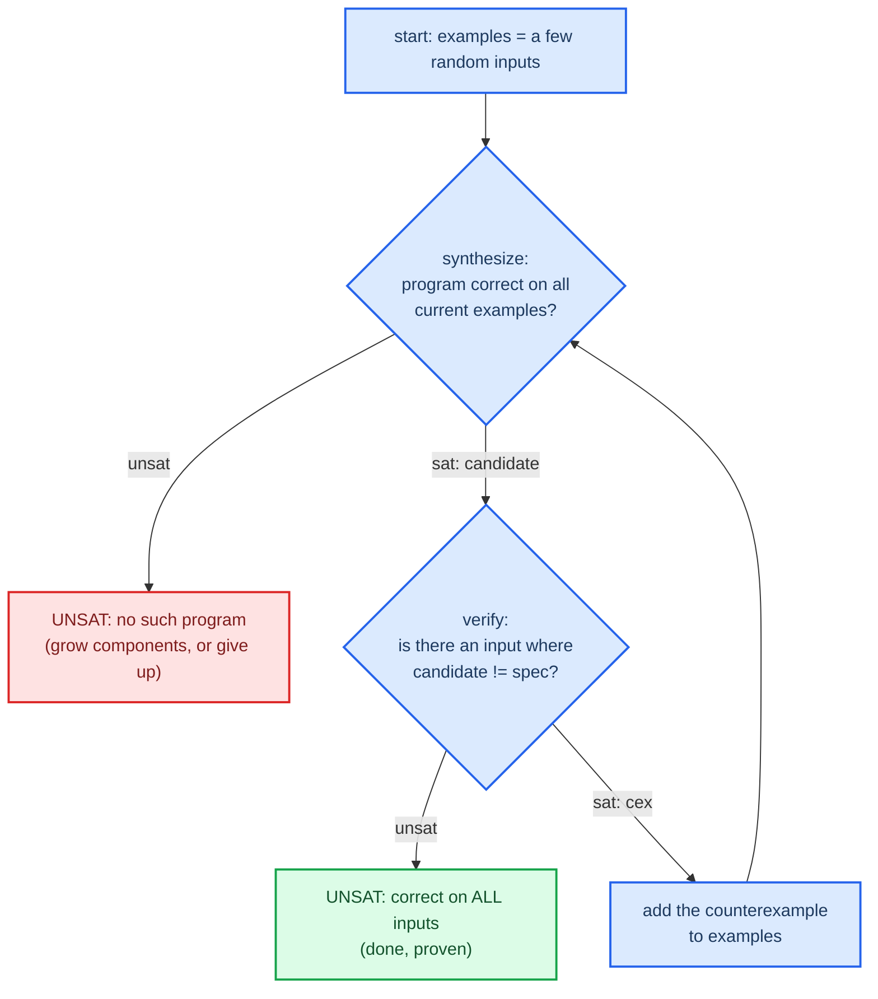

# CEGIS — counterexample-guided inductive synthesis

The core technique of Phase 4. CEGIS turns the expensive "find a program correct
on every input" into a loop of cheap queries over a small, growing set of test
inputs.

## The problem it solves

Synthesis wants `∃P. ∀x. P(x) = spec(x)`: there's a program such that for all
inputs it matches the spec. That `∃∀` alternation is what makes direct synthesis
hard (see [[03-synthesis-and-constants]]).

CEGIS, which came out of Solar-Lezama's sketching work,[^sketch] gets around it.
Rather than quantify over all inputs at once, it keeps a finite set of example
inputs and alternates two quantifier-free queries.

## The loop

The synthesis query asks, over the finite example set, for a program — a wiring
of components plus any constant values — that's correct on every example
currently in the set. The inputs are concrete, so this query is quantifier-free.

The verification query is the equivalence check from
[[02-equivalence-via-unsat]]: is there an input where this candidate disagrees
with the spec? UNSAT means no failing input exists, so the candidate is correct
for all inputs, and I'm done. SAT means the model is a counterexample input. I
add it to the examples and loop.

## Why it terminates, and why it's correct

It's correct because the loop only exits when verification returns UNSAT, and
that's a genuine all-inputs proof, the same logic as a plain equivalence check.
The examples are just a way to find the candidate. They're never trusted as the
proof. The proof is the final UNSAT.

It terminates because the candidate space — programs of bounded size over a
fixed component set, with bit-vector constants — is finite. Each counterexample
forces the next synthesized candidate to differ from the last one on at least
that input, so no candidate gets proposed twice. A finite space with no repeats
has to halt. In practice it converges in a handful of rounds, nowhere near the
size of the input space.

That's the real payoff: CEGIS replaces one hard `∀` with repeated `∃` queries
over a growing sample, and lets counterexamples teach the synthesizer which
inputs actually matter.

## Component-based encoding (Jha et al. 2010)

This is how the synthesis query represents "a program" as variables the solver
can solve for. Full treatment in [[papers/jha-2010]]; the essentials:

Fix a multiset of components, the operations available — say one `NEG` and one
`AND`. Give every component output and every program input a line number. Then
introduce location variables: for each component input, a variable saying which
line it reads from. Solving for the location variables is the same as choosing
the dataflow wiring. On top of that go the well-formedness constraints.

| Constraint | Meaning | Bug if you get it wrong |
|------------|---------|-------------------------|
| consistency | each line is defined by exactly one component | duplicate or clobbered definitions |
| acyclicity | a component only reads lines defined before it | a value used before it exists |
| completeness | every input location points at a real line | a dangling wire |

The connection constraints are the classic silent-bug zone. An off-by-one
between "before" and "at-or-before" gives you a synthesizer that finds wrong
programs which still pass the examples. The project `CLAUDE.md` flags this as a
derive-it-yourself area, so I'll trace a three-component example by hand before
trusting the encoding, with the working in `encodings/cegis-constraints.md`.

Constants are handled the same way as in [[03-synthesis-and-constants]]: each
constant slot is a free bit-vector variable the synthesis query solves for.

## Next

Next: [[05-optimality]], what it actually means to call a synthesized program
optimal.

[^sketch]: Solar-Lezama, A. (2008). *Program Synthesis by Sketching.* PhD thesis, UC Berkeley. https://people.csail.mit.edu/asolar/papers/thesis.pdf
