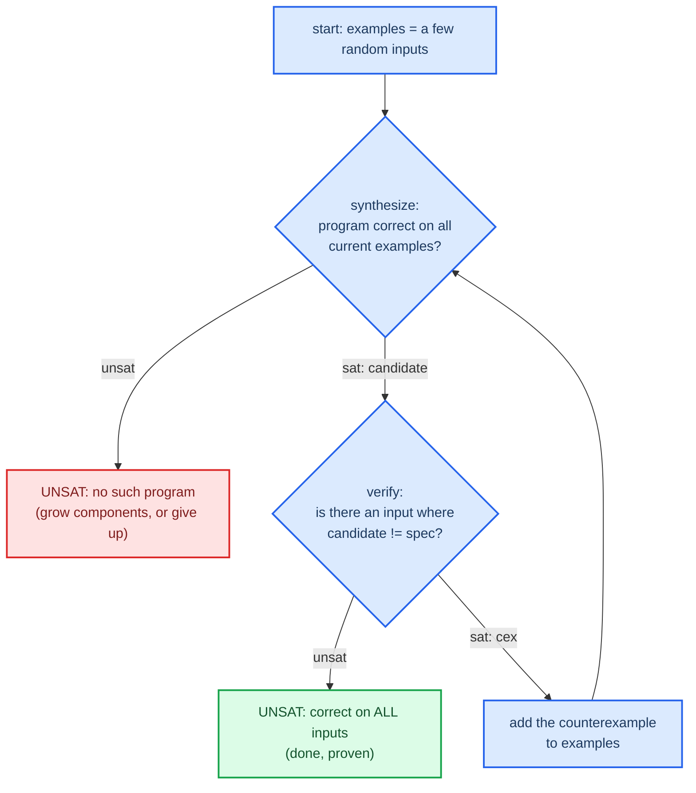

# CEGIS - counterexample-guided inductive synthesis

This is the central technique used in Phase 4; it transforms the hard question "find $P$ s.t. $P(x) = \text{spec}(x)$ for all $x$" into a series of cheap questions over a finite number of inputs.

## The Question it Solves

We want to find $P$ s.t. $P(x) = \text{spec}(x)$ for all $x$. The use of a quantified variable $x$ makes the above an difficult problem (see [[03-synthesis-and-constants]]). CEGIS (originally proposed by Solar-Lezama for sketching, [^sketch]) reformulates this problem. Instead of trying to reason over an infinite space of inputs, CEGIS maintains a finite set of example inputs and alternates between two unquantified problems.

## The Loop

The synthesis question asks whether there exists a choice of wiring and constants (from the set of components we have) that evaluates to spec on all the examples in the set. This question is unquantified and hence significantly cheaper to answer than the original question. The verification question asks whether there exists an input where candidate and spec behave differently. This question is also unquantified. The program is deemed complete if the verification phase returns UNSAT (meaning it is correct on all inputs). Otherwise the found program is a candidate; we add its differing inputs (counterexamples) to the set of examples and ask again.

## Correctness and Termination

Correctness is given by the fact that the only time the loop terminates is when the verification query is UNSAT. This is a full proof of correctness for all inputs, analogous to an equivalence check. The examples that are used are not evidence of a correct program; they are only tools to help find candidates. CEGIS is guaranteed to terminate because the space of candidate programs that could be synthesized at any given stage is finite (limited number of components to choose from, limited maximum component sizes and bounded ranges of constants to synthesize). Each new counterexample uniquely constrain the search space of possible candidates and ensures progress on the current step of synthesis. CEGIS usually converges in a few loops, much less than the input space size. CEGIS makes use of the property that a problem that is impossible to solve exhaustively can be broken down into many small tractable problems.

## Component-based Encoding (Jha et al. 2010)

This represents a program in a way that a solver can understand. A program that takes some inputs and applies a circuit has each input, each output of a component, and each input to a component designated a line number. We introduce variables to represent which line number each input to a component is connected to; these are our "location" variables and are responsible for representing the dataflow. Additionally, constraints that enforce the well-formedness of the circuit are included.

| Constraint      | What it does               | What is an error if violated  |
| --------------- | -------------------------- | ----------------------------- |
| consistency     | each line may have only one source | two components write to the same line, or no component writes to the line |
| acyclicity      | input must always be from a previous line  | a component depends on the output of another component which depends on the first component's input. |
| completeness    | every line with an output may have an input    | no wire connects to the line carrying the output |

Connection constraints can be subtle; you must think carefully about whether inputs should be "less than" the input, or "less than or equal to" it. This is one of the difficult things that makes CEGIS (and logic-based program synthesis) difficult and is what necessitates some manual analysis to determine constraints (for a simple 3-component example, the constraints can be determined manually before an automatic encoding (see `encodings/cegis-constraints.md`)). We can also synthesize arbitrary constants by having their value represented by a free bit-vector variable.

## Next

What is meant when a synthesized program is "optimal"? This is addressed in [[05-optimality]]

[^sketch]: Solar-Lezama, A. (2008). Program Synthesis by Sketching. PhD thesis, UC Berkeley. https://people.csail.mit.edu/asolar/papers/thesis.pdf
