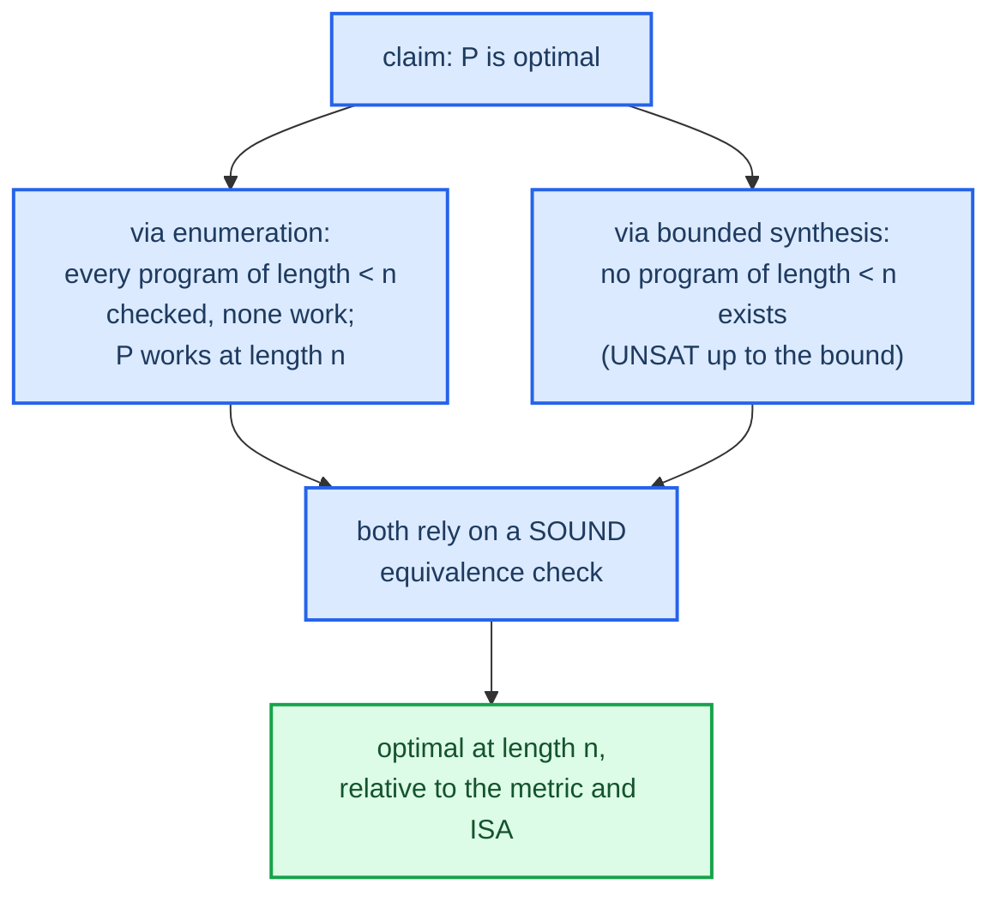

# What "optimal" means

"Provably optimal" is the project's headline claim, so the word has to be pinned
down. Optimality is always relative to three things: the instruction set, the
cost metric, and the equivalence definition. Change any one of them and the
optimal program can change.

## Optimal relative to a cost metric

| Metric | "Best" means | Notes |
|--------|--------------|-------|
| instruction count | fewest instructions | the Phase 3–4 default, simplest to define and prove |
| latency | shortest dependency-chain time | needs per-op latency numbers, a Phase 5 stretch |
| throughput, code size, energy | other resource models | each can pick a different winner |

A two-instruction sequence with one slow multiply can lose on latency to a
three-instruction sequence of shifts and adds, even though it wins on count. So
"optimal" with no stated metric means nothing. This project fixes the metric up
front: minimum instruction count for Phases 3 and 4, with `const` counted as
free, and revisits latency only as a documented Phase 5 extension.

## What makes it provable

There are two routes to the word "optimal," and they're not equally strong.

The enumeration route (Phase 3) searches every program of length 1, 2, and so
on. The first length `n` where a verified-equivalent program shows up is
optimal, because every shorter length was ruled out exhaustively. The exhaustion
is the proof.

The bounded-synthesis route (Phase 4) asks "is there a correct program of length
less than `n`?" and gets UNSAT. That UNSAT is the no-shorter-program proof,
without explicit enumeration.

Both routes inherit their trust from the equivalence check being sound — the
encoding has to model the program faithfully (see [[02-equivalence-via-unsat]]).
A wrong encoding can make a wrong program look optimal.

## The honest scope of the claim

When the report says "optimal," the statement I can actually defend is this:
minimum instruction count over this instruction set, proven by exhausting (or
ruling out by UNSAT) every shorter program, under an equivalence check whose
faithfulness an independent fuzz harness corroborates.

Here's what that claim does not say, and what I shouldn't let it imply. It's not
optimal under a different instruction set — add a fused operation and the answer
might shrink. It's not necessarily the fastest, because count isn't latency. And
on the bounded-synthesis route, it says nothing past the search bound.

Stating those limits plainly is part of the honest-framing rule in the project
`CLAUDE.md`. It also makes the result more credible, not less.

## Back

Back to [[index]], the theory map. The next practical step is in the project
`PLAN.md`: Phase 0, the Z3 hello-world.
