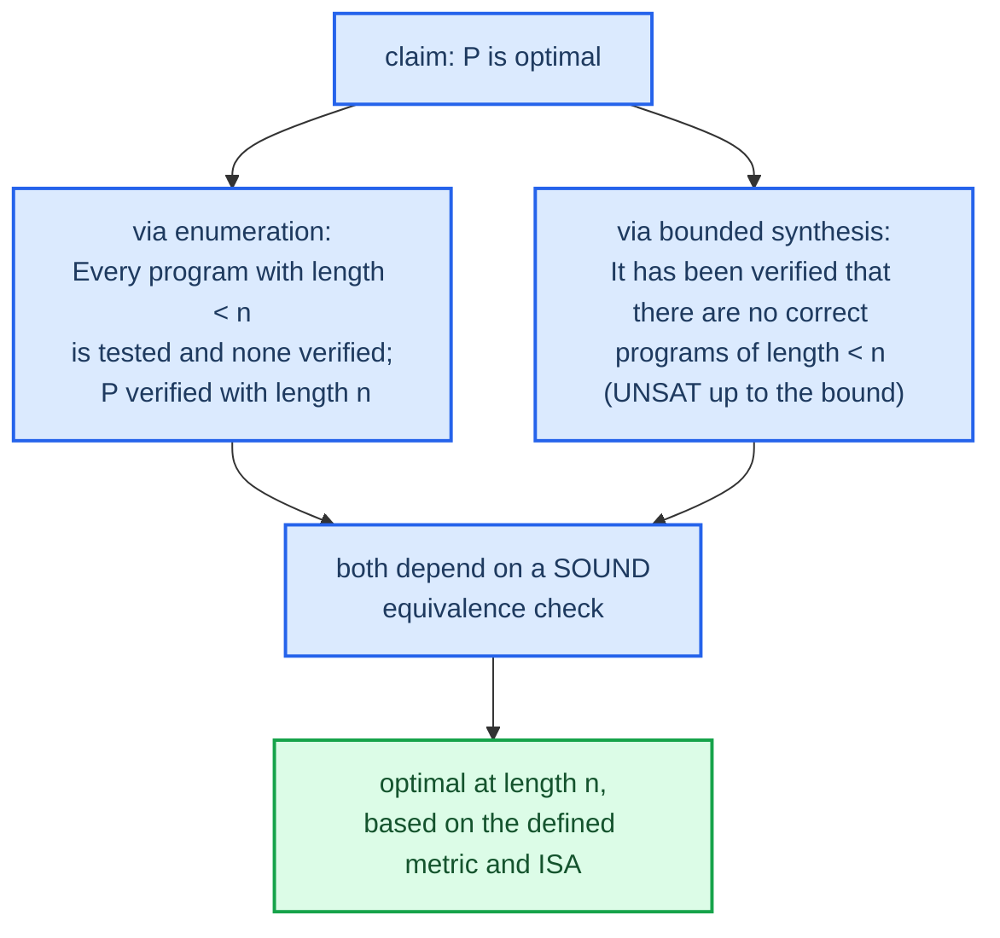

# What does "optimal" mean

"Provably optimal" is the project's flagship claim, therefore we have to precisely define it. Optimality must always be relative to a certain three variables, the ISA, the cost measure and the definition of equivalence. We must be aware that altering any of these three variables can alter the optimal program.

## Optimal with regards to a cost measure

| Cost Metric         | Definition of "Best"                                  | Additional Information                                             |
|---------------------|-------------------------------------------------------|--------------------------------------------------------------------|
| instruction count   | least number of instructions                          | Default for Phases 3-4. This is the easiest to define and prove. |
| latency             | smallest duration on the critical dependency chain      | This requires latency values for each operation, and it's an extension of Phase 5. |
| throughput, code size, energy | Other measures of code quality                     | It is very likely that these measures result in different optimal programs. |

A sequence of two instructions, one of them being a slow multiply instruction, can result in a slower execution when compared with a sequence of three shift/add instructions. However, the former wins in instruction count. This is why, if a metric is not stated explicitly, "optimal" is meaningless. In this project, the metric used is the minimal number of instructions (Phases 3 & 4), assuming `const` instructions take zero cycles and focusing only on instruction count before analyzing latencies (Phase 5).

## What constitutes a provable optimality?

Two methods are commonly employed when striving for an "optimal" claim. They differ in their strength.

The enumeration method (Phase 3) verifies each possible program of increasing length. The first program that is proven to be equivalent to the original, if its length is $n$, is considered optimal, as all programs with a length shorter than $n$ have been thoroughly tested and rejected. This rigorous testing process serves as proof.

The bounded synthesis method (Phase 4) questions whether a correct program of shorter length than $n$ exists, and responds UNSAT. This UNSAT response serves as proof that no such shorter program can exist.

Both of these methods depend for their credibility on the soundness of the equivalence check, that is, on the accuracy of the encoding which must perfectly represent the behavior of the program (see [[02-equivalence-via-unsat]]). A faulty encoding can lead to the incorrect claim of an optimal program.

## The true extent of the claim

When the report uses the word "optimal," I can honestly defend the following statement: it represents the minimum number of instructions for the given instruction set, proven by the exhaustive testing (or rejection via UNSAT) of all shorter programs under a reliable equivalence check verified by an independent fuzzing tool.

The following are statements that this claim does not make and that I should avoid implying:

*   It is not necessarily optimal under a different instruction set; the introduction of a fused operation could reduce the instruction count.
*   It is not necessarily the fastest possible execution, because instruction count does not directly translate to execution speed.
*   On the bounded synthesis route, it says nothing beyond the specific search boundary.

Clearly stating these limitations is in line with the project's principle of honesty. Furthermore, clarity will improve the result's credibility, not diminish it.

## Back

To the [[index]] (the theory map). The next practical step for the project lies in `PLAN.md` which introduces Phase 0, a "Hello World" equivalent for Z3.
